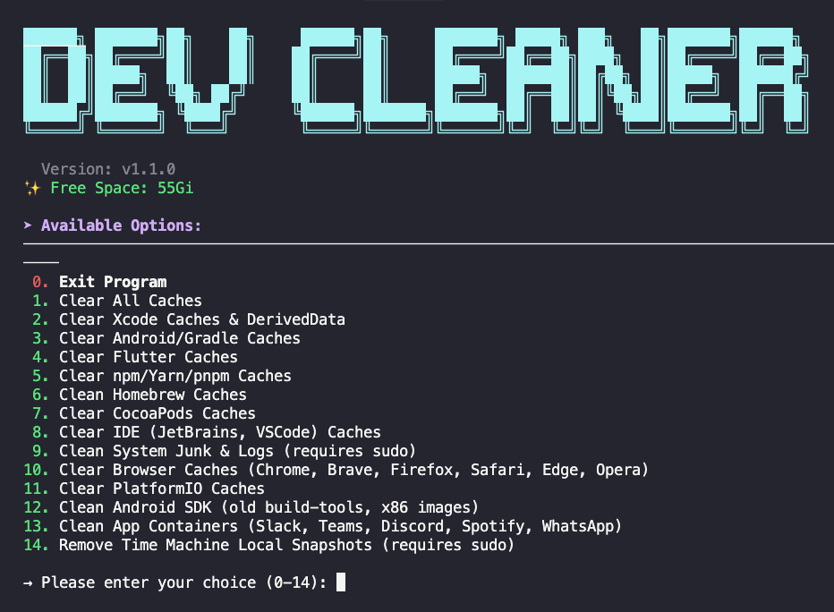

# 🧹 Dev Cleaner Utility

<p align="center">
    <a href="YOUR_GITHUB_REPO_LINK">
        
    </a>
    <a href="YOUR_GITHUB_REPO_LINK/stargazers">
        
    </a>
</p>

<p align="center">
  <br>
</p>

## Support Latest macOS/Linux Dev Environments

This tool is for **educational purposes**, focusing on safely removing development-related junk files (Xcode, Flutter, npm, etc.) to free up disk space.

---

### ✨ Features

* **One-Click Cleanup:** Clear Xcode, Flutter, Gradle, npm, Homebrew, IDE, and browser caches.
* **Comprehensive Flutter Cleanup:** Recursively finds and cleans all Flutter projects, removing:
  * FVM SDK caches and configurations (`.fvm`, `.fvmrc`)
  * Flutter build artifacts (`build`, `.dart_tool`, `.packages`, `pubspec.lock`)
  * Android Gradle caches (`android/.gradle`, `android/build`, `android/app/build`)
  * iOS CocoaPods caches (`ios/Pods`, `ios/Podfile.lock`, `ios/.symlinks`, Flutter frameworks)
  * Global Flutter cache
* **Interactive Menu:** Allows selection of specific cleanup targets (e.g., Xcode only).
* **Multi-platform Support:** Supports **macOS** and **Linux** (shell script).

---

### 💻 System Support

| Operating System | Architecture | Supported |
| :--------------- | :----------- | :-------- |
| macOS            | Intel, Apple Silicon | ✅        |
| Linux            | x64, ARM64   | ✅        |
| Windows          | N/A          | ❌ (PowerShell script pending) |

---

### 👀 How to Use

#### ⭐ Auto Run Script

**Linux/macOS**

To download, grant permission, and run the utility in one line:

```bash
curl -fsSL https://raw.githubusercontent.com/jemishavasoya/dev-cleaner/main/dev-cleaner.sh -o dev-cleanup.sh && chmod +x dev-cleanup.sh && ./dev-cleanup.sh
```

#### 🍺 Install via Homebrew

**macOS/Linux**

For a permanent installation using Homebrew:

```bash
# Tap the repository
brew tap jemishavasoya/dev-cleaner

# Install dev-cleaner
brew install dev-cleaner

# Run the utility
dev-cleaner

# Check version
dev-cleaner --version
```

To update to the latest version:

```bash
brew update
brew upgrade dev-cleaner
```

To uninstall:

```bash
brew uninstall dev-cleaner
brew untap jemishavasoya/dev-cleaner
```

#### 🧹 Flutter Cleanup Details

The Flutter cleanup option (Option 4) performs a comprehensive recursive cleanup of all Flutter projects starting from the current directory. It:

- **Recursively searches** for all `pubspec.yaml` files
- **Removes FVM** SDK caches and configurations
- **Cleans build artifacts**: `build/`, `.dart_tool/`, `.packages`, `pubspec.lock`
- **Removes Android Gradle** caches from each project
- **Removes iOS CocoaPods** caches and Flutter frameworks
- **Cleans global Flutter cache**

**💡 Pro Tip:** If you have active projects you work on daily, consider running the cleanup from a specific subdirectory (e.g., `~/old_projects` or `~/research`) rather than your entire development folder. This avoids unnecessary rebuilds of dependencies for active projects.

**Expected Space Savings:** Users have reported freeing up 50-100GB+ of disk space after running Flutter cleanup on multiple projects.
### You can also buy me a cup of coffee &nbsp;&nbsp;&nbsp;&nbsp;&nbsp;&nbsp;<a href="https://www.buymeacoffee.com/jempatellbv" target="_blank"></a>

## 🤩 Contribution 

We welcome you to submit Issues and Pull Requests!

<a href="https://github.com/jemishavasoya/dev-cleaner/graphs/contributors">
  
</a>
<br /><br />
