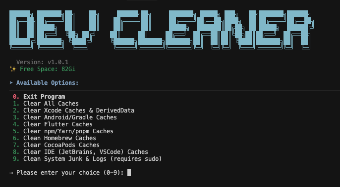

# 🧹 Dev Cleaner Utility

<p align="center">
    <a href="YOUR_GITHUB_REPO_LINK">
        
    </a>
    <a href="YOUR_GITHUB_REPO_LINK/stargazers">
        
    </a>
</p>

<p align="center">
  <br>
</p>

## Support Latest macOS/Linux Dev Environments

This tool is for **educational purposes**, focusing on safely removing development-related junk files (Xcode, Flutter, npm, etc.) to free up disk space.

---

### ✨ Features

* **One-Click Cleanup:** Clear Xcode, Flutter, Gradle, npm, Homebrew, and IDE caches.
* **Interactive Menu:** Allows selection of specific cleanup targets (e.g., Xcode only).
* **Multi-platform Support:** Supports **macOS** and **Linux** (shell script).

---

### 💻 System Support

| Operating System | Architecture | Supported |
| :--------------- | :----------- | :-------- |
| macOS            | Intel, Apple Silicon | ✅        |
| Linux            | x64, ARM64   | ✅        |
| Windows          | N/A          | ❌ (PowerShell script pending) |

---

### 👀 How to Use

#### ⭐ Auto Run Script

**Linux/macOS**

To download, grant permission, and run the utility in one line:

```bash
curl -fsSL https://raw.githubusercontent.com/jemishavasoya/dev-cleaner/main/dev-cleaner.sh -o dev-cleanup.sh && chmod +x dev-cleanup.sh && ./dev-cleanup.sh
```
### You can also buy me a cup of coffee &nbsp;&nbsp;&nbsp;&nbsp;&nbsp;&nbsp;<a href="https://www.buymeacoffee.com/jempatellbv"></a>
